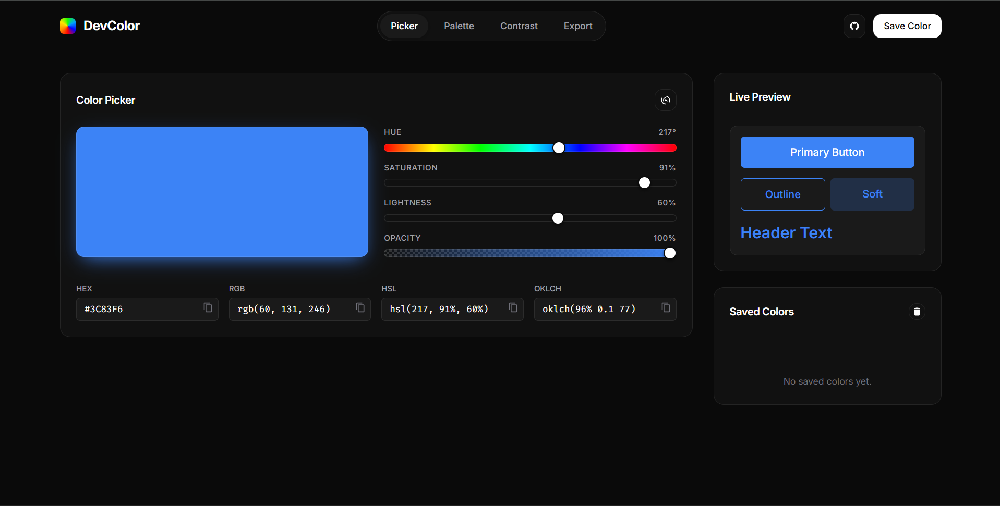

<div align="center">

# 🎨 DevColor

### The fastest and most beautiful open-source color toolkit for developers and designers.

Generate palettes, gradients, convert color formats, test accessibility, and export production-ready code.




</div>

---

# ✨ Features

- 🎨 Modern Color Picker
- 🌈 Palette Generator
- 🌀 Gradient Generator
- 📋 One-click Copy
- 🎯 HEX, RGB, HSL & more
- ♿ Accessibility Contrast Checker
- 💻 CSS & Tailwind Export
- 🌙 Beautiful Dark UI
- ⚡ Fast & Lightweight
- 📱 Responsive Design

---

# 📸 Preview

> Replace this with the latest screenshot after every major update.


---

# 🚀 Getting Started

Clone the repository:

```bash
git clone https://github.com/johanjomet/devcolor.git
```

Open the project:

```bash
cd devcolor
```

Then simply open `index.html` in your browser.

No installation required.

---

# 🛠 Tech Stack

- HTML5
- CSS3
- Vanilla JavaScript

---

# 📦 Roadmap

## Version 1.0

- [x] Beautiful UI
- [x] Color Picker
- [ ] Palette Generator
- [ ] Gradient Generator
- [ ] Color Converter
- [ ] Copy Buttons

## Version 1.1

- [ ] Accessibility Checker
- [ ] Saved Palettes
- [ ] CSS Export
- [ ] Tailwind Export

## Version 2.0

- [ ] Image Color Extraction
- [ ] Palette Sharing
- [ ] Theme Gallery
- [ ] AI Palette Suggestions

---

# 🤝 Contributing

Contributions are always welcome!

If you'd like to contribute:

1. Fork the repository
2. Create a new branch

```bash
git checkout -b feature/amazing-feature
```

3. Commit your changes

```bash
git commit -m "feat: add amazing feature"
```

4. Push the branch

```bash
git push origin feature/amazing-feature
```

5. Open a Pull Request

---

# 🐛 Found a Bug?

Please open an Issue and include:

- Browser
- Operating System
- Steps to reproduce
- Expected behavior
- Screenshots (if applicable)

---

# 💡 Why DevColor?

Developers often use multiple websites for colors, gradients, palettes, and accessibility.

DevColor brings these tools together in one fast, modern, open-source application designed for developers and designers.

---

# ⭐ Support the Project

If you find DevColor useful:

⭐ Star this repository

🍴 Fork it

📢 Share it

Every star helps the project grow.

---

# 👨‍💻 Author

**Johan Jomet**

Founder of **JJ Coders**

GitHub: https://github.com/johanjomet

---

# 📄 License

This project is licensed under the MIT License.

See the LICENSE file for details.
